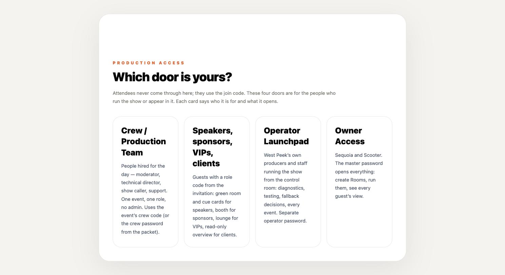
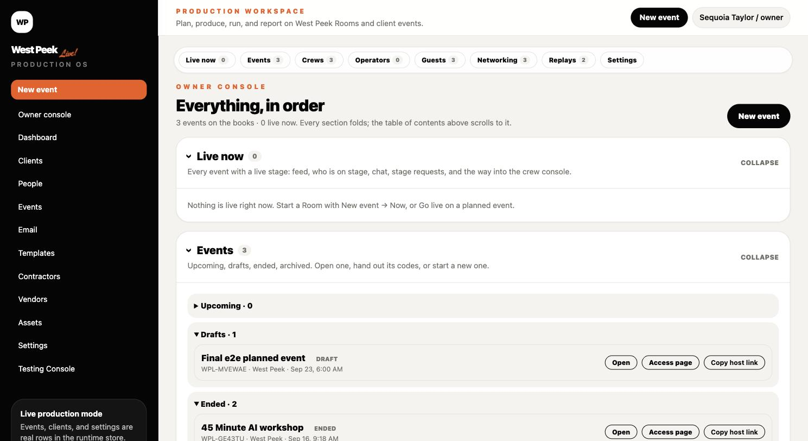
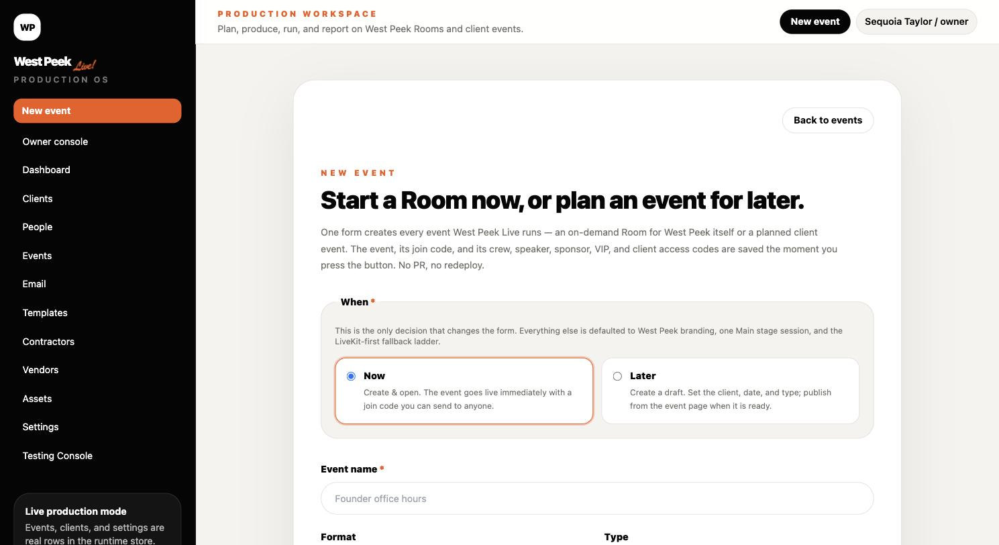
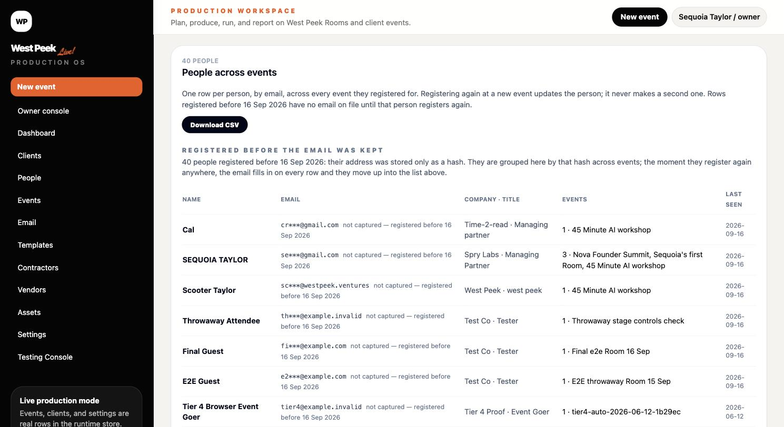
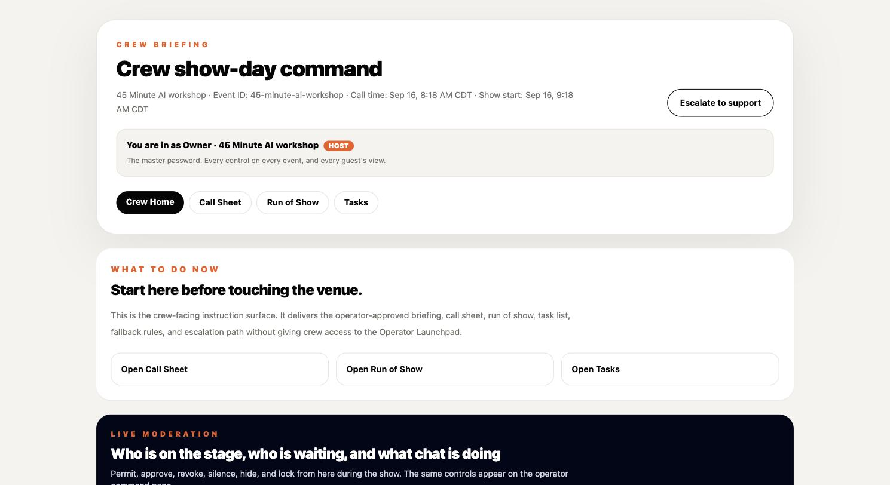
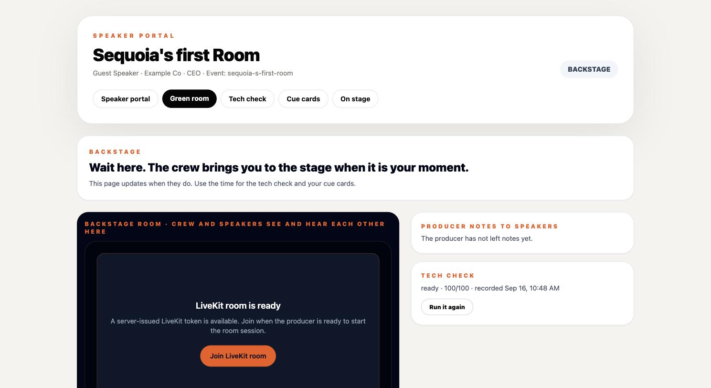
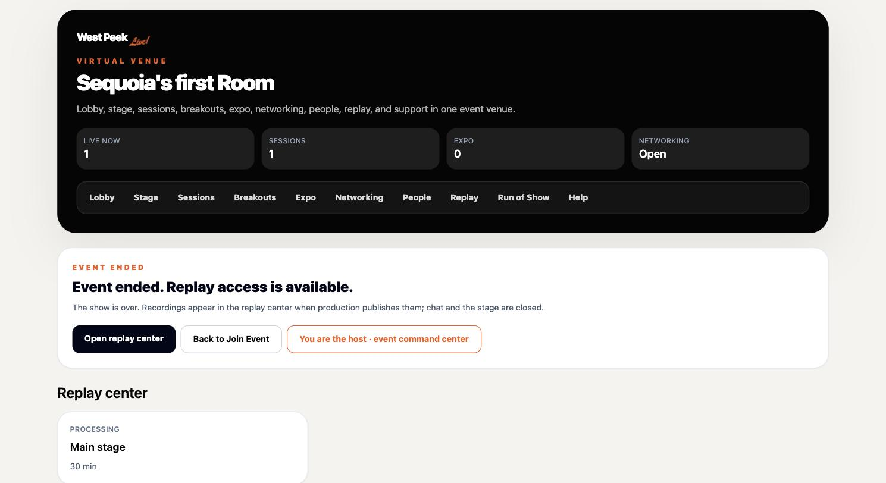
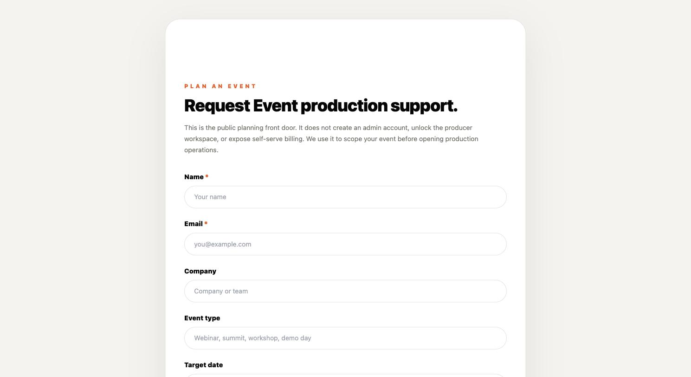

# West Peek Live — Owner, Operator, Crew & Guest Manual (v3)

Status: ACTIVE. Supersedes `docs/archive/superseded/docs__West_Peek_Live_Day1_Complete_Product_Operator_Manual_v2.md`.

| Field | Value |
| --- | --- |
| Canonical domain | https://westpeek.live |
| Worker fallback URL | https://west-peek-live.seq-taylor.workers.dev |
| Hosting | Cloudflare Workers (**Paid**, $5/mo — 30 s CPU, 10M req/mo, 128 variables) |
| Database | Supabase (Free tier — see §12) |
| Video | LiveKit Cloud, project `westpeek-live` (**Ship**, $50/mo) |
| Backup video | Cloudflare Stream Live, input `westpeek-fallback` (pay-as-you-go) |
| Email | Resend |
| Storage | Supabase Storage, private bucket `event-assets` |
| Read this inside the app | `westpeek.live/manual` (owner + operator) |
| Last revised | 16 September 2026 |

> **No access codes appear in this document.** Every code lives behind the owner gate in the app. See §5.

---

## Table of contents

1. [What this is, in plain terms](#1-what-this-is-in-plain-terms)
2. [The five doors](#2-the-five-doors)
3. [If you are the OWNER — step by step](#3-if-you-are-the-owner--step-by-step)
4. [If you are an OPERATOR (West Peek internal) — step by step](#4-if-you-are-an-operator-west-peek-internal--step-by-step)
5. [Access codes — how they are made, where they live, how to change them](#5-access-codes--how-they-are-made-where-they-live-how-to-change-them)
6. [If you are CREW — step by step](#6-if-you-are-crew--step-by-step)
7. [If you are a SPECIAL GUEST — speaker, sponsor, VIP, client](#7-if-you-are-a-special-guest--speaker-sponsor-vip-client)
8. [If you are an ATTENDEE](#8-if-you-are-an-attendee)
9. [Files and assets](#9-files-and-assets)
10. [Clients who want us to run their event](#10-clients-who-want-us-to-run-their-event)
11. [The fallback ladder — what to do when the feed dies](#11-the-fallback-ladder--what-to-do-when-the-feed-dies)
12. [Show-day runbook](#12-show-day-runbook)
13. [Capacity, cost, and where the ceiling is](#13-capacity-cost-and-where-the-ceiling-is)
14. [Troubleshooting](#14-troubleshooting)
15. [Rules that do not bend](#15-rules-that-do-not-bend)

---

## 1. What this is, in plain terms

West Peek Live runs a virtual event end to end: the public page people register on, the venue they sit in, the stage they watch, the chat they talk in, the networking that pairs them up, and the console the crew runs it all from.

Everybody does not get the same door. **Attendees** attend. **Crew** executes. **Speakers** prepare and appear. **Sponsors** work their booth. **Clients** review. **VIPs** get a lounge. **Operators** run the show. The **owner** sees and overrides everything.

The video model is layered on purpose:

- **StreamYard** is where the show is produced — the source.
- **LiveKit** distributes that feed to everyone in the venue, and is the only layer that can bring an attendee *onto* the stage.
- **Cloudflare Stream** is the backup that still accepts the StreamYard feed if LiveKit fails. Watch-only.
- **Daily / Zoom / Google Meet** are continuity rooms below that. They cannot take a StreamYard feed; somebody has to turn a camera on.

---

## 2. The five doors

`westpeek.live/production-access` — "Which door is yours?"

| Door | URL | Who | What it opens |
| --- | --- | --- | --- |
| **Owner Access** | `/production-access/owner` | Sequoia, Scooter | Everything: create Rooms, run them, every guest's view, billing, settings |
| **Operator Launchpad** | `/production-access/operator` | West Peek producers and staff | The control room: diagnostics, testing, fallback decisions, every event. Separate operator password |
| **Crew / Production Team Access** | `/production-access/crew` | People hired for the day — moderator, technical director, show caller, support | One event, one role, no admin |
| **Speakers, sponsors, VIPs, clients** | `/production-access/special-guest` | Guests with a role code from the invitation | Green room and cue cards, booth, lounge, read-only client overview |
| **Public join** | `/join` or `/events/{eventId}` | Attendees | Registration and the venue |

**Owner = host everywhere.** The master password makes you a host on any event and opens every crew, operator and guest surface without collecting another password. A crew member holding the `executive_producer` role is also a host. There are **two master passwords**; both work on every gate.

---

## 3. If you are the OWNER — step by step

### 3.1 Get in

1. Go to `westpeek.live/production-access` → **Owner Access**.
2. Enter a master password. You land on the **Owner Console**.

### 3.2 The Owner Console

`westpeek.live/app/owner` — "Everything, in order."

A table of contents across the top; every section folds and remembers whether you left it open.

| Section | What it holds |
| --- | --- |
| **Live now** | Every event with a live stage: feed state, who is on stage, chat, **Stage requests Open/Closed**, End show, and the way into the crew console |
| **Events** | Upcoming / Drafts / Ended / Archived. Each with Open · Access page · Copy host link |
| **Crews** | Per event: crew code, host link (copy + revoke), "Make someone the host", crew deck |
| **Operators** | The launchpad, who has an operator session, the testing console per event |
| **Guests** | Speakers, sponsors, VIPs, clients — open their real pages **as them**, role codes with copy links, preview a guest |
| **Networking** | Queue size, matches in progress, open or closed |
| **Replays** | Per ended event: whether a replay is ready |
| **Access codes** | Every event's six codes and the global gate passwords (§5) |
| **Settings** | Global configuration |

### 3.3 Start a Room right now

1. **New event** (top right of any workspace page, or the sidebar) → `/app/events/new`.
2. **When: Now** — the only decision that changes the form. Everything else defaults to West Peek branding, one Main stage session, and the LiveKit-first fallback ladder.
3. Name it → **Create & open**.
4. You get a join code (`WPL-XXXXXX`), an access page, and a crew deck immediately. No PR, no redeploy.

**Later** instead of Now creates a draft with a client, date and type; publish it from the event page when it is ready.

**Going live is one button, in one card.** The Go-live card appears on the event's Publish page, on the event's row in the Owner Console (and in **Live now** once it is running), and at the top of the crew deck — the same card in all three. Press **Go live** and the event goes live *and* the stream credentials appear underneath: the RTMP URL, the stream key (masked until **Reveal**), **Copy both for StreamYard**, and the three steps to paste them in. You never have to open a second page to start a show.

### 3.4 See everyone who has ever registered

`/app/people` — one row per person, by email, across every event they attended. Registering again at a new event updates the person; it never makes a second one. **Download CSV** exports the list.

People who registered before 16 Sep 2026 have no email on file (only a hash was kept back then); the moment they register again anywhere, the email fills in on every row.

### 3.5 Hand off the show

Owner Console → **Crews** → **Copy host link** → send it to whoever is running it. The link prefills the crew gate; they press Enter and hold the host banner, go-live, end-the-show and every control **for that event only**. **Revoke host link** rotates the crew code and kills the link and anyone who entered with it.

---

## 4. If you are an OPERATOR (West Peek internal) — step by step

An operator is West Peek staff running the control room. Same building as the owner, fewer keys: no billing, no global settings, no "view as any guest".

1. `westpeek.live/production-access/operator` → operator password → **Launchpad**.
2. **Your events** — pick the event you are operating, or start a new one.
3. **Set up an event**: setup, agenda, run of show, access codes, speakers, sponsors, comms, publish.
4. **Run a show**: the crew deck, go-live, moderation, networking, end the show.
5. **Diagnostics** (`/admin/testing`): route health, runtime readiness, security smoke tests, video provider checks. Run these before a client show.
6. **Demo & training**: the demo venue mirrors the real components with safe data — train here, never on a client event.

**Operator vs crew, in one line:** the operator sets the event up and owns the system; the crew executes one event on the day.

---

## 5. Access codes — how they are made, where they live, how to change them

### The shape

Every code for an event is built from the same stem: **the first six letters or digits of the event name**, uppercased.

| Who | Code | Opens |
| --- | --- | --- |
| Attendees | `WPL-45MINU` | The venue, via `/join` |
| Crew | `WPL-CREW-45MINU` | `/crew/events/…` — moderation, go-live, end the show |
| Speaker | `WPL-SPEAKER-45MINU` | `/speaker/events/…` — green room, cue cards, stage |
| Sponsor | `WPL-SPONSOR-45MINU` | `/sponsor/events/…` — booth, leads |
| Client | `WPL-CLIENT-45MINU` | `/client/…` — approvals, reports, scoped to their own slug |
| VIP | `WPL-VIP-45MINU` | The venue plus the VIP badge and lounge |

Codes are **UPPERCASE**, matched **case-insensitively**, and the join code is accepted with or without the `WPL-` prefix — `45minu` gets in.

**Why the roles are separate credentials:** the code *is* the role. A sponsor holding the client's code would be reading the paying client's approvals and reports. Each one opens a different area and nothing else.

**Collisions:** two events whose names begin the same way — "Sequoia's first Room" and "Sequoia's second Room" both give `SEQUOI` — get a disambiguated stem (`SEQUOI2`), applied across all six roles for that event.

**Renaming an event does not change its codes.** Links already sent keep working. If you want the codes to follow the new name, press **Regenerate codes from the new name** — deliberately, knowing the old ones die.

Because codes are derived from the event name they are guessable by design. The protection is at the door, not in the string: **code entry is rate-limited at every gate**, and failed attempts on privileged codes are logged and visible in the Owner Console.

### Custom codes

Any code can be set by hand instead.

1. Owner Console → **Access codes**, or the event's **Access** page.
2. Type your own: **4–24 characters, letters, digits and hyphens, unique across events.**
3. Save. The old code **stops working immediately**, and the notice says exactly what that killed — crew sessions and crew links, or guests sent back to the gate, or old join links.
4. **Regenerate** puts a code back to the automatic `WPL-…` form.

A hand-set code **wins over the generated one** and survives a rename. Who can do this: owner, operator, and producers holding `manage_access_codes`; anyone else sees the row read-only with the reason.

### Where to find them

**Owner Console → Access codes** is the one place. Every event — upcoming, ended and archived — with all six codes masked until **Reveal**, plus **Copy**, **Copy all codes for this event**, **Rotate**, and a search that takes either an event name or a code someone has handed you and tells you which event it belongs to.

The four **global** gate passwords sit in the same place:

| Key | In the vault |
| --- | --- |
| `OWNER_MASTER_ACCESS_PASSWORD` | Value shown — masked, Reveal, Copy |
| `OPERATOR_LAUNCHPAD_PASSWORD` | Value shown |
| `CREW_ACCESS_PASSWORD` | Value shown |
| `OWNER_MASTER_ACCESS_PASSWORD_2` | Marked **set**; the spare key's value is held separately and not shown |

Those values render **only** under an owner session — an operator never receives them — and every Reveal or Copy writes an audit row naming the key, never the value.

**No access code or password appears anywhere in this manual**, and a validator fails the build if one is ever added.

## 6. If you are CREW — step by step

`westpeek.live/crew/events/{event}` — "Crew show-day command."

### Before the doors open

1. Open the host link you were sent, or `/production-access/crew` + the event's crew code.
2. Read **What to do now**, then **Call Sheet**, **Run of Show**, **Tasks**.
3. Confirm the event's call time and show start at the top of the page — they render in **your** time zone.

### Going live

1. The **Go-live card** is the first thing on the deck. Press **Go live**: the event goes live and the credentials appear in the same card. If the show has been ended before, the card says so — the stream key was released on purpose — and **Get stream credentials** mints a fresh one in a click.
2. **Copy both for StreamYard**, then in StreamYard **edit** your existing Custom RTMP destination (do not add a second one) and start broadcasting. Add the **Cloudflare fallback** as a second destination at the same time (§11).
3. The stage flips live within seconds. Confirm on a second device.

**Ending a show releases the stream key.** That is deliberate: a key left behind in somebody's StreamYard must not work on the next show. Restarting is one press of **Get stream credentials** from whichever surface you are on — the Owner Console will do it without opening the deck.

### During the show

| Control | What it does |
| --- | --- |
| **Stage requests: Open / Closed** | One switch for camera and mic requests together. Closed = no hands up |
| Approve / revoke a raised hand | Approved attendee appears on stage with **mic off** by default |
| Silence · Hide · Lock chat | Per person, or the whole room |
| Bring a speaker to the stage / send backstage | From the speaker roster |
| Networking | Open or close the queue; matcher pairs people into 1:1 rooms with a timer |
| Move down / Move back up | The fallback ladder (§10) |
| **End the show** | Deliberate. Releases the feed, marks the event ENDED, every viewer's stage says so |

Everyone is **permitted to watch by default**. You only approve people to come *on* the stage.

---

## 7. If you are a SPECIAL GUEST — speaker, sponsor, VIP, client

All four enter at `westpeek.live/production-access/special-guest` with the role code from the invitation, then give their name once.

### Speaker

1. Enter with the speaker code (`WPL-SPEAKER-…`).
2. **Tech check** — camera, mic, connection. It scores you and records the time.
3. **Cue cards** — your talking points, and the producer's notes to speakers when they leave them.
4. **Green room / backstage** — crew and speakers see and hear each other here. Wait; the crew brings you to the stage at your moment. The page updates by itself.
5. **On stage** — your camera and mic publish when the crew brings you up.

### Sponsor

Booth page, lead capture, ready room, and a post-event report.

### VIP

The VIP badge and the **VIP lounge**, which is open by default.

**Nobody is a VIP without the VIP code.** There are two ways to hold it:

- **Enter it yourself** — at the special-guest gate, or on the **"Have a VIP code?"** card in the lobby if you have already registered as an attendee.
- **An official issues it** — owner or crew press **Make VIP**, which grants that person the event's VIP code and records who granted it, when, and which version of the code.

A per-event **VIP email list** pre-authorises people: a matching email at registration is admitted as VIP under the current code, recorded the same way.

**Rotating the VIP code revokes every VIP admitted under the old one**, including the ones crew granted. The roster shows, for each VIP, how they got in and which version of the code they hold.

### Client

A read-only overview: approvals, assets, reports, run of show, timeline. Clients never see crew controls.

---

## 8. If you are an ATTENDEE

1. Go to `westpeek.live/join`, type the event code (case does not matter; the `WPL-` prefix is optional), or open the public event link.
2. **Register** — Name, Email, Company. Title optional.
3. Land in the **venue**: Lobby · Stage · Sessions · Breakouts · Expo · Networking · People · Replay · Run of Show · Help. If the event is already live you land **on the stage**.
4. **Tell us more** — an optional card under the chat; the questions are set per event.
5. **Hide me from the People directory** — a toggle; crew still see you, networking still works.
6. **Raise a hand** to join the stage when the crew has stage requests open.
7. When the show ends the stage says so and the **replay centre** appears when production publishes it.

---

## 9. Files and assets

Every file for an event lives in one place: **the event's Assets page**, with a cross-event view at `/app/assets` grouped by event.

**Uploading.** Drag a file in, or choose one. It goes straight from the browser to storage through a short-lived signed URL — the file never passes through our server. If storage is ever unreachable the page says so plainly and offers **paste a link** instead, which is also how a Drive or Dropbox file gets in.

**Speakers and sponsors upload from their own portals** — the green room and the booth. Their files arrive marked **in review**, and they can only see their own.

**Crew review**, per file: **Approve · Ask for changes · Show the client · Make internal · Archive**.

- **Show the client** is what puts a file in the client's portal. Clients see approved, client-facing files only.
- **Archive, never delete.** There is no delete path in the product, and the build fails if one is ever added.

**Downloads are signed and expire after ten minutes**, and are refused to anyone without owner, operator or crew access to that event.

---

## 10. Clients who want us to run their event

### What the client does

1. **`westpeek.live/request-event`** — Plan an event. Name, email, company, event type, target date, audience size, **budget**. It does not create an account or expose billing.
2. West Peek scopes it and sends back an **approval with a price**.
3. The client **confirms and pays**.
4. On payment, the instructions go out — and every instruction is a **web page we can update**, not a PDF frozen at send time.

### The instruction pages we send

| Sent to | Page | What it covers |
| --- | --- | --- |
| Client | `westpeek.live/how-it-works/client` | What happens between now and show day, what we need from you, who to contact |
| Their crew (if they bring their own) | `westpeek.live/how-it-works/crew` | The crew gate, the deck, go-live, moderation, the fallback ladder, end the show |
| Speakers | `westpeek.live/how-it-works/speaker` | The speaker code, tech check, cue cards, green room, being brought to stage |
| Sponsors | `westpeek.live/how-it-works/sponsor` | Booth setup, leads, the ready room |
| Attendees | `westpeek.live/how-it-works/attendee` | The join code, registering, what is in the venue, how to ask a question |

These pages are editable by West Peek from the workspace, so an instruction fix reaches everyone who already has the link.

> **Status:** the `/how-it-works/*` pages and the approve → price → pay → instructions flow are in the build queue as of 16 Sep 2026. Until they ship, send the client the scoping email manually and point crew at §6 of this manual.

---

## 11. The fallback ladder — what to do when the feed dies

| Rung | Attendees see | Keeps the StreamYard feed? | Configured |
| --- | --- | --- | --- |
| **Primary — LiveKit ingress** | The show, and attendees can be brought on stage | Yes | Yes |
| **Fallback 1 — Cloudflare Stream** | The show in a Cloudflare player, watch-only | **Yes** | Yes (`westpeek-fallback`) |
| Fallback 2 — Daily | Only if a host turns a camera on | No | Yes |
| Fallback 3 — Zoom embedded | Zoom meeting in the page | No | Yes |
| Fallback 4 — Google Meet | Leaves the venue | No | Yes |

**Before the show:** add Cloudflare as a **second destination** in StreamYard (Destinations → Add destination → Custom RTMP). The RTMPS URL and key are on the crew deck's Fallback 1 card with copy buttons. Broadcast to **both**.

**When LiveKit fails:** crew deck → **"Move down: Cloudflare Stream"**. Attendees swap in about ten seconds, same page; chat, roster and networking are untouched.

**While on Cloudflare** you cannot bring an attendee onto the stage — that is WebRTC, LiveKit only.

**When LiveKit is healthy again:** **"Move back up"**.

The card refuses to move down if that rung is not configured, rather than sending everyone to a blank player.

---

## 12. Show-day runbook

| When | Do |
| --- | --- |
| T-24h | Event published. Codes handed out. Speakers confirmed in the green room, tech checks recorded |
| T-60m | Crew in the deck. StreamYard open with **both** destinations set |
| T-30m | Broadcast privately, confirm the stage shows the feed, then stop |
| T-10m | Stage requests **Closed** until you want hands up. VIP lounge open. Chat unlocked |
| T-0 | **Go live** from the card (Publish page, Owner Console row, or crew deck — same card). Confirm from a second device on a different network |
| During | Moderate. Approve raised hands. Watch the ladder |
| End | **End the show** from the card. The stream key is released; restarting later needs one press of **Get stream credentials** |
| After | Replay appears when published. Export contacts from `/app/people` |

---

## 13. Capacity, cost, and where the ceiling is

| Service | Plan | Included | First cliff |
| --- | --- | --- | --- |
| LiveKit | **Ship** $50/mo | 600 transcode min, 150,000 participant-min, 1,000 concurrent | **Transcode minutes** — every minute of StreamYard feed burns one |
| Cloudflare Workers | **Paid** $5/mo | 10M requests, 30 s CPU, 128 variables | Variable count (128) |
| Cloudflare Stream | Pay as you go | — | $5 / 1,000 min stored, $1 / 1,000 min delivered |
| Supabase | Free | 500 MB, shared compute, 5 GB egress | **Pauses after 7 days idle**; no backups |

A 90-minute Room with 200 people costs roughly **nothing extra** on these plans. The practical ceiling today is Supabase's shared compute at around a thousand simultaneous chatters. Supabase Pro ($25/mo) buys daily backups and no auto-pause — worth it the first time a paying client's event is on the line.

---

## 14. Troubleshooting

| Symptom | Cause | Fix |
| --- | --- | --- |
| "Code not ready" on join | Unpublished event, or a typo | Matching is case-insensitive and prefix-tolerant; if it persists the event is a draft — publish it |
| Attendees stuck on "Connecting…" | Stale browser bundle after a deploy | Hard refresh (⌘⇧R). This was a real regression once; it is fixed, but the refresh still clears a cached bundle |
| Stage black, StreamYard says live | Feed not reaching LiveKit, or the ingress was not provisioned | Crew deck → Go live → regenerate credentials; if it will not recover, move down to Cloudflare |
| Crew page shows a section as "unavailable" | A runtime table is missing | By design it fails soft instead of taking the page down. Check Supabase migrations |
| Timestamps look wrong | — | Every time renders in the **viewer's** time zone. If it looks off, it is the data, not the display |
| Venue still says "Event ended" after going live again | — | Fixed: taking an ended event live resets its stage |
| Someone sees the stage who should not | — | Everyone is permitted to watch by default; that is intended. Only stage *access* is approved |
| A gate asks for a password you already entered | Your session expired — owner sessions last 12 hours | Re-enter at `/production-access/owner` |
| A page behaves as if you are not signed in, right after a deploy | Stale bundle in an open tab | The app should prompt and reload itself; if it does not, hard refresh (⌘⇧R) |
| A privileged code stopped working | Someone rotated it, or set a custom one | Owner Console → Access codes shows the current one |

---

## 15. Rules that do not bend

- Events are **archived, never deleted**.
- Nothing is ever emailed to an attendee automatically without a crew click.
- Seed and demo data never appear as real data on an `/app` page.
- Access codes are shown in the app, never written into a document or a repo.
- A rotated code kills every link built from the old one.
- Test rows (`example.com`, `example.invalid`, Playwright fixtures) are hidden from real people lists.
- Client instructions are **editable pages**, never frozen attachments.
- Files are **archived, never deleted** — there is no delete path in the product.
- Nobody is a **VIP** without the VIP code; rotating it revokes everyone admitted under the old one.
- The owner chip says **"Owner"**, never a person's name — the master password is shared, so the app cannot know which of you it is.
- This manual is updated **in the same pull request** as any change it describes.
