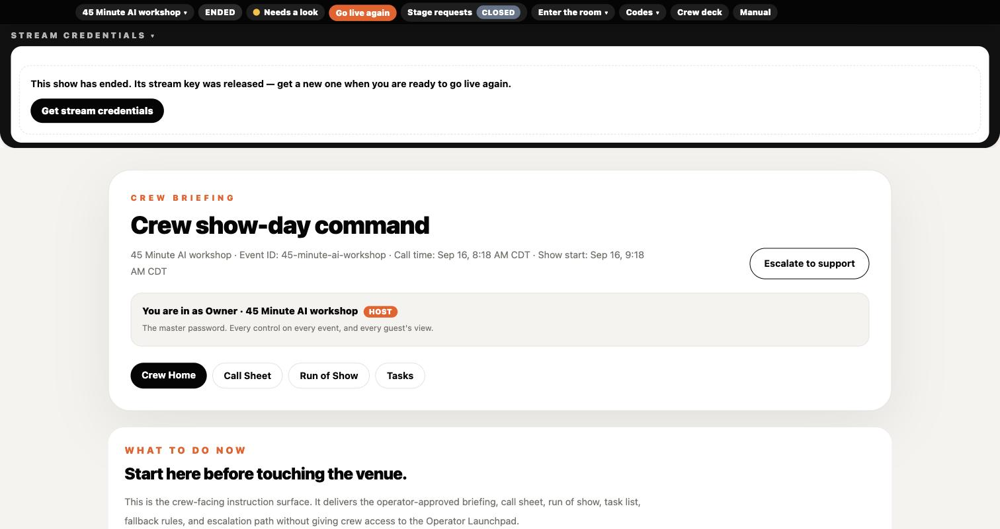
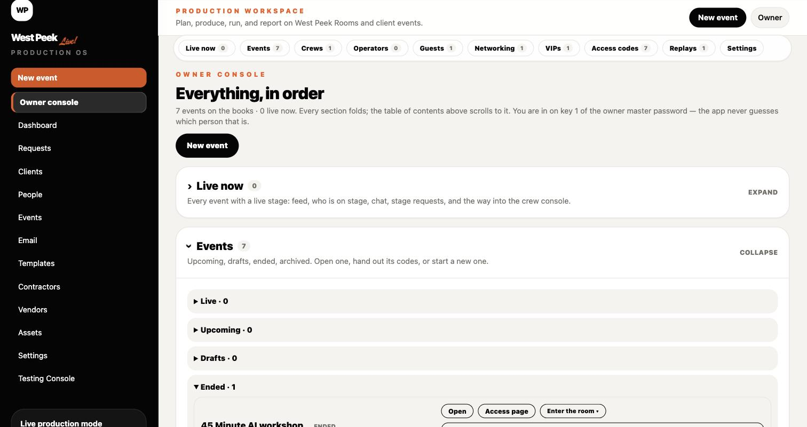
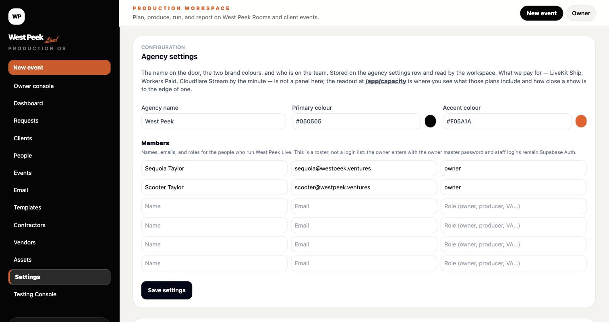
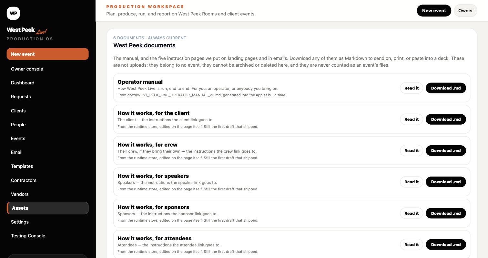
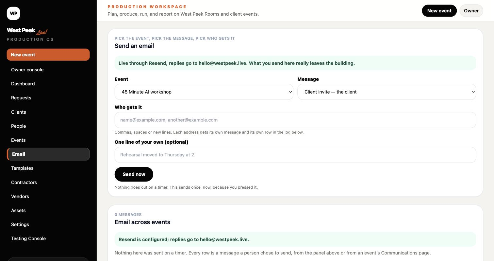
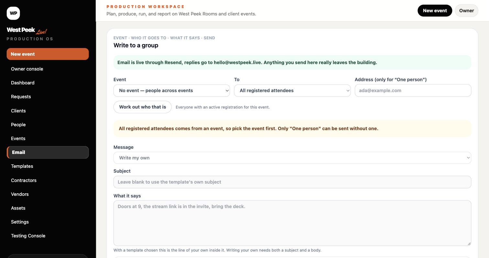
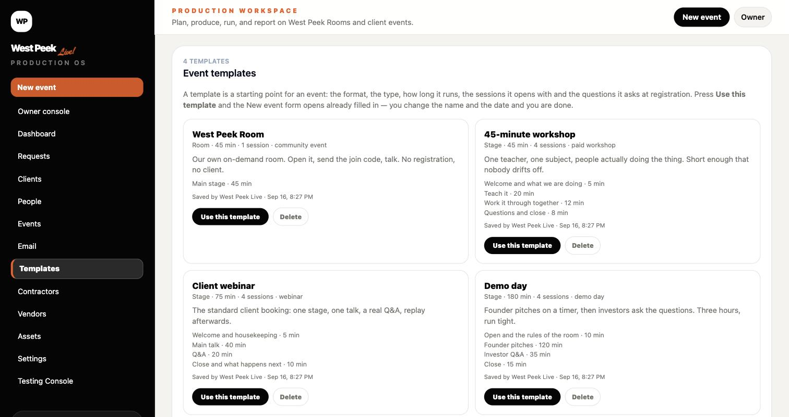
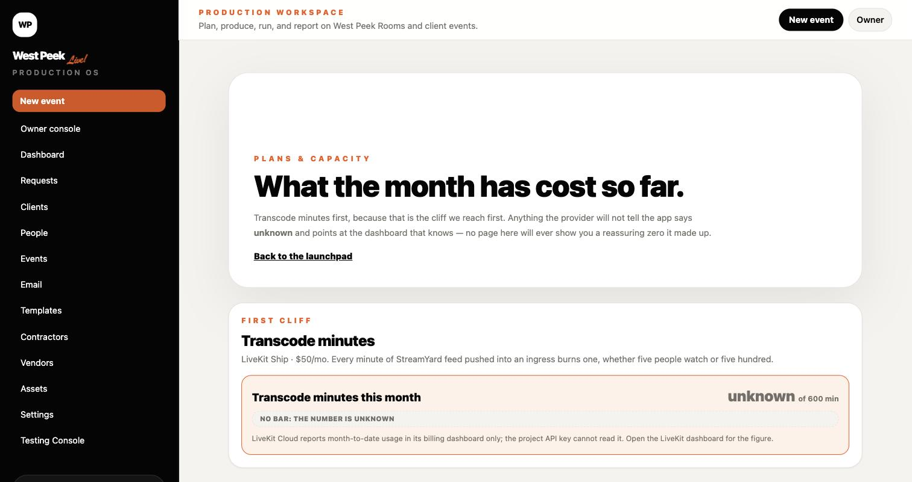

# West Peek Live — Owner, Operator, Crew & Guest Manual (v4)

Status: ACTIVE. Supersedes `docs/archive/superseded/docs__West_Peek_Live_Day1_Complete_Product_Operator_Manual_v2.md`.

| Field | Value |
| --- | --- |
| Canonical domain | https://westpeek.live |
| Worker fallback URL | https://west-peek-live.seq-taylor.workers.dev |
| Hosting | Cloudflare Workers (**Paid**, $5/mo — 30 s CPU, 10M req/mo, 128 variables) |
| Database | Supabase (Free tier — see §16) |
| Video | LiveKit Cloud, project `westpeek-live` (**Ship**, $50/mo) |
| Backup video | Cloudflare Stream Live, input `westpeek-fallback` (pay-as-you-go) |
| Storage | Supabase Storage, private bucket `event-assets` |
| Read this inside the app | `westpeek.live/manual` (owner + operator) |
| Download it | **Assets → West Peek documents → Operator manual → Download .md**, or from the repo at `docs/WEST_PEEK_LIVE_OPERATOR_MANUAL_V3.md` |
| Email | Resend — house addresses set in Settings |
| Last revised | 17 September 2026 |

> **No access codes appear in this document.** Every code lives behind the owner gate in the app. See §5.

---

## Table of contents

1. [What this is, in plain terms](#1-what-this-is-in-plain-terms)
2. [The five doors](#2-the-five-doors)
3. [If you are the OWNER — step by step](#3-if-you-are-the-owner--step-by-step)
4. [If you are an OPERATOR (West Peek internal) — step by step](#4-if-you-are-an-operator-west-peek-internal--step-by-step)
5. [Access codes — how they are made, where they live, how to change them](#5-access-codes--how-they-are-made-where-they-live-how-to-change-them)
6. [If you are CREW — step by step](#6-if-you-are-crew--step-by-step)
7. [If you are a SPECIAL GUEST — speaker, sponsor, VIP, client](#7-if-you-are-a-special-guest--speaker-sponsor-vip-client)
8. [If you are an ATTENDEE](#8-if-you-are-an-attendee)
9. [Files, assets and documents](#9-files-assets-and-documents)
10. [Email — one composer, one log](#10-email--one-composer-one-log)
11. [Templates](#11-templates)
12. [Contractors and vendors](#12-contractors-and-vendors)
13. [Clients who want us to run their event](#13-clients-who-want-us-to-run-their-event)
14. [The fallback ladder — what to do when the feed dies](#14-the-fallback-ladder--what-to-do-when-the-feed-dies)
15. [Show-day runbook](#15-show-day-runbook)
16. [Capacity, cost, and where the ceiling is](#16-capacity-cost-and-where-the-ceiling-is)
17. [How a database change reaches production](#17-how-a-database-change-reaches-production)
18. [Troubleshooting](#18-troubleshooting)
19. [Rules that do not bend](#19-rules-that-do-not-bend)

---

## 1. What this is, in plain terms

West Peek Live runs a virtual event end to end: the public page people register on, the venue they sit in, the stage they watch, the chat they talk in, the networking that pairs them up, and the console the crew runs it all from.

Everybody does not get the same door. **Attendees** attend. **Crew** executes. **Speakers** prepare and appear. **Sponsors** work their booth. **Clients** review. **VIPs** get a lounge. **Operators** run the show. The **owner** sees and overrides everything.

The video model is layered on purpose:

- **StreamYard** is where the show is produced — the source.
- **LiveKit** distributes that feed to everyone in the venue, and is the only layer that can bring an attendee *onto* the stage.
- **Cloudflare Stream** is the backup that still accepts the StreamYard feed if LiveKit fails. Watch-only.
- **Daily / Zoom / Google Meet** are continuity rooms below that. They cannot take a StreamYard feed; somebody has to turn a camera on.

---

## 2. The five doors

`westpeek.live/production-access` — "Which door is yours?"

| Door | URL | Who | What it opens |
| --- | --- | --- | --- |
| **Owner Access** | `/production-access/owner` | Sequoia, Scooter | Everything: create Rooms, run them, every guest's view, billing, settings |
| **Operator Launchpad** | `/production-access/operator` | West Peek producers and staff | The control room: diagnostics, testing, fallback decisions, every event. Separate operator password |
| **Crew / Production Team Access** | `/production-access/crew` | People hired for the day — moderator, technical director, show caller, support | One event, one role, no admin |
| **Speakers, sponsors, VIPs, clients** | `/production-access/special-guest` | Guests with a role code from the invitation | Green room and cue cards, booth, lounge, read-only client overview |
| **Public join** | `/join` or `/events/{eventId}` | Attendees | Registration and the venue |

**Owner = host everywhere.** The master password makes you a host on any event and opens every crew, operator and guest surface without collecting another password. A crew member holding the `executive_producer` role is also a host. There are **two master passwords**; both work on every gate, and the console tells you which one you came in on.

**Each password names its own door** — `owner-access-2027!`, `operator-launchpad-2027!`, `crew-access-2027!` — and they rotate with the year. That makes them guessable on purpose, so the defending happens at the gate: six wrong attempts from one place and it stops answering for two minutes. The values themselves are in the vault (§5), never in this document.

---

## 3. If you are the OWNER — step by step

### 3.1 Get in

1. Go to `westpeek.live/production-access` → **Owner Access**.
2. Enter a master password. You land on the **Owner Console**.

### 3.2 The command bar — the thing you will actually use

On **every page that belongs to an event** — the workspace, the crew deck, the venue, a speaker's or sponsor's page — a single bar sits at the top for owner and operator only. Nobody else ever sees it.

`Event name ▾ · status · health · Go live / End show · Stage requests · Enter the room ▾ · Codes ▾ · Crew deck · Manual`

Everything on it acts **where you are**. You do not navigate to go live, to open stage requests, to copy a code, or to walk into the room. The event name is a switcher, so you can move between events without going back to a list.

**The health dot** shows the worst of nine signals — feed, stage, webhook, fallback, database, chat, attendees, build, capacity. It never reads green off a check that did not run: a probe with no answer reads **grey**, and every signal names its source and when it was last looked at. A yellow or red one tells you what to do, with the button in the panel.

**Enter the room ▾** is how you see the event as somebody else:

| Entry | What you get |
| --- | --- |
| **Myself (host)** | The stage with your own identity and every control. No code |
| An attendee · A VIP · A speaker · A sponsor · The client | The real page as that kind of person sees it — **before anyone has entered a code** |
| A named guest | That person's own page, with their own state |

Previews are **read-only at the service layer**, not merely hidden: nothing typed in one can be saved, and a preview never appears in a count, a directory, a roster, networking or an export.

### 3.3 The Owner Console

`westpeek.live/app/owner` — "Everything, in order."

A table of contents across the top; every section folds and remembers whether you left it open.

| Section | What it holds |
| --- | --- |
| **Live now** | Every event with a live stage: feed state, who is on stage, chat, **Stage requests Open/Closed**, End show, and the way into the crew console |
| **Events** | Upcoming / Drafts / Ended / Archived. Each with Open · Access page · Copy host link |
| **Crews** | Per event: crew code, host link (copy + revoke), "Make someone the host", crew deck |
| **Operators** | The launchpad, who has an operator session, the testing console per event |
| **Guests** | Speakers, sponsors, VIPs, clients — open their real pages **as them**, role codes with copy links, preview a guest |
| **Networking** | Queue size, matches in progress, open or closed |
| **Replays** | Per ended event: whether a replay is ready |
| **Access codes** | Every code for every event, and the global gate passwords (§5) |
| **Settings** | The agency name, the brand colours, the team roster, and the house defaults every new event inherits |

**Settings** is where the house defaults live — the agency name, the brand colours, the team roster, and the things every new event should inherit rather than be asked about each time.

### 3.4 Start a Room right now

1. **New event** (top right of any workspace page, or the sidebar) → `/app/events/new`.
2. **When: Now** — the only decision that changes the form. Everything else defaults to West Peek branding, one Main stage session, and the LiveKit-first fallback ladder.
3. Name it → **Create & open**.
4. You get a join code (`WPL-XXXXXX`), an access page, and a crew deck immediately. No PR, no redeploy.

**Later** instead of Now creates a draft with a client, date and type; publish it from the event page when it is ready.

**Going live is one button, in one card.** The Go-live card appears on the event's Publish page, on the event's row in the Owner Console (and in **Live now** once it is running), and at the top of the crew deck — the same card in all three. Press **Go live** and the event goes live *and* the stream credentials appear underneath: the RTMP URL, the stream key (masked until **Reveal**), **Copy both for StreamYard**, and the three steps to paste them in. You never have to open a second page to start a show.

### 3.5 See everyone who has ever registered

`/app/people` — one row per person, by email, across every event they attended. Registering again at a new event updates the person; it never makes a second one. **Download CSV** exports the list.

People who registered before 16 Sep 2026 have no email on file (only a hash was kept back then); the moment they register again anywhere, the email fills in on every row.

Our own test rows — Playwright fixtures and `example.com` addresses — are **counted apart and hidden** behind a toggle, so the headline number is your real network. You can archive them, and the archive never touches a row from a real event.

### 3.6 Hand off the show

Owner Console → **Crews** → **Copy host link** → send it to whoever is running it. The link prefills the crew gate; they press Enter and hold the host banner, go-live, end-the-show and every control **for that event only**. **Revoke host link** rotates the crew code and kills the link and anyone who entered with it.

---

## 4. If you are an OPERATOR (West Peek internal) — step by step

An operator is West Peek staff running the control room. Same building as the owner, fewer keys: no billing, no global settings, no "view as any guest".

1. `westpeek.live/production-access/operator` → operator password → **Launchpad**.
2. **Your events** — pick the event you are operating, or start a new one.
3. **Set up an event**: setup, agenda, run of show, access codes, speakers, sponsors, comms, publish.
4. **Run a show**: the crew deck, go-live, moderation, networking, end the show.
5. **Diagnostics** (`/admin/testing`): route health, runtime readiness, security smoke tests, video provider checks. Run these before a client show.
6. **Demo & training**: the demo venue mirrors the real components with safe data — train here, never on a client event.

**Operator vs crew, in one line:** the operator sets the event up and owns the system; the crew executes one event on the day.

---

## 5. Access codes — how they are made, where they live, how to change them

### The shape

Every code for an event is built from the same stem: **the first six letters or digits of the event name**, uppercased. So an event called "Nova Summit" has the stem `NOVASU`, and its six codes are the prefixes below with that stem on the end. No real code appears in this document, and a validator fails the build if one ever does.

| Who | Code | Opens |
| --- | --- | --- |
| Attendees — **the event code** | `WPL-` + the stem | The venue, via `/join` |
| Crew | `WPL-CREW-` + the stem | `/crew/events/…` — moderation, go-live, end the show |
| Speaker | `WPL-SPEAKER-` + the stem | `/speaker/events/…` — green room, cue cards, stage |
| Sponsor | `WPL-SPONSOR-` + the stem | `/sponsor/events/…` — booth, leads |
| Client | `WPL-CLIENT-` + the stem | `/client/…` — approvals, reports, scoped to their own slug |
| VIP | `WPL-VIP-` + the stem | The venue plus the VIP badge and lounge |

Codes are **UPPERCASE**, matched **case-insensitively**, and the event code is accepted with or without the `WPL-` prefix — typing the stem alone gets in.

**Why the roles are separate credentials:** the code *is* the role. A sponsor holding the client's code would be reading the paying client's approvals and reports. Each one opens a different area and nothing else.

**Collisions:** two events whose names begin the same way — "Sequoia's first Room" and "Sequoia's second Room" both give `SEQUOI` — get a disambiguated stem (`SEQUOI2`), applied across all six roles for that event.

**Renaming an event does not change its codes.** Links already sent keep working. If you want the codes to follow the new name, press **Regenerate codes from the new name** — deliberately, knowing the old ones die.

Because codes are derived from the event name they are guessable by design. The protection is at the door, not in the string: **code entry is rate-limited at every gate**, and failed attempts on privileged codes are logged and visible in the Owner Console.

### Custom codes

Any code can be set by hand instead.

1. Owner Console → **Access codes**, or the event's **Access** page.
2. Type your own: **4–24 characters, letters, digits and hyphens, unique across events.**
3. Save. The old code **stops working immediately**, and the notice says exactly what that killed — crew sessions and crew links, or guests sent back to the gate, or old event-code links.
4. **Regenerate** puts a code back to the automatic `WPL-…` form.

A hand-set code **wins over the generated one** and survives a rename. Who can do this: owner, operator, and producers holding `manage_access_codes`; anyone else sees the row read-only with the reason.

### Where to find them

**Owner Console → Access codes** is the one place. Every event — upcoming, ended and archived — with all six codes masked until **Reveal**, plus **Copy**, **Copy all codes for this event**, **Rotate**, and a search that takes either an event name or a code someone has handed you and tells you which event it belongs to.

The four **global** gate passwords sit in the same place:

| Gate | Shape | In the vault |
| --- | --- | --- |
| Owner Access | `owner-access-<year>!` | Value shown — masked, Reveal, Copy |
| Operator Launchpad | `operator-launchpad-<year>!` | Value shown |
| Crew / Production Team Access | `crew-access-<year>!` | Value shown |
| Owner Access — second key | *(not derived from anything)* | Marked **set**; the value is never shown, here or in the vault |

The first three name the door they open and carry the year, so they rotate on a schedule you can remember. Rotating is one command, printed on the card in the vault.

**The second owner key is different on purpose.** It is the West Peek password Sequoia and Scooter already share — *an address, in camel case* — and it is the one to use when the predictable key is not appropriate: from a borrowed machine, over a shoulder, or if the first key has been handed around and not yet rotated. It follows no pattern anyone could work out from the outside, it is **never displayed** in the vault or anywhere else in the app, and it is not written down here. Both keys open every gate; the console tells you which one you came in on.

Those values render **only** under an owner session — an operator never receives them — and every Reveal or Copy writes an audit row naming the key, never the value.

**No access code or password appears anywhere in this manual**, and a validator fails the build if one is ever added.

## 6. If you are CREW — step by step

`westpeek.live/crew/events/{event}` — "Crew show-day command."

### Before the doors open

1. Open the host link you were sent, or `/production-access/crew` + the event's crew code.
2. Read **What to do now**, then **Call Sheet**, **Run of Show**, **Tasks**.
3. Confirm the event's call time and show start at the top of the page — they render in **your** time zone.

### Going live

1. The **Go-live card** is the first thing on the deck. Press **Go live**: the event goes live and the credentials appear in the same card. If the show has been ended before, the card says so — the stream key was released on purpose — and **Get stream credentials** mints a fresh one in a click.
2. **Copy both for StreamYard**, then in StreamYard **edit** your existing Custom RTMP destination (do not add a second one) and start broadcasting. Add the **Cloudflare fallback** as a second destination at the same time (§14).
3. The stage flips live within seconds. Confirm on a second device.

**Ending a show releases the stream key.** That is deliberate: a key left behind in somebody's StreamYard must not work on the next show. Restarting is one press of **Get stream credentials** from whichever surface you are on — the Owner Console will do it without opening the deck.

### During the show

| Control | What it does |
| --- | --- |
| **Stage requests: Open / Closed** | One switch for camera and mic requests together. Closed = no hands up |
| Approve / revoke a raised hand | Approved attendee appears on stage with **mic off** by default |
| Silence · Hide · Lock chat | Per person, or the whole room |
| Bring a speaker to the stage / send backstage | From the speaker roster |
| Networking | Open or close the queue; matcher pairs people into 1:1 rooms with a timer |
| Move down / Move back up | The fallback ladder (§14) |
| **Diagnose** (per person on the roster) | Answers "I can't see it": connected or not, their connection quality, **which video tracks actually reached them**, their app version and browser. It separates never-connected from receiving-nothing (ours) from a poor line (theirs) |
| **See their view** (per person) | Opens the stage rendered with **their** real state — their VIP standing, whether they are silenced, what you have permitted them. Read-only, and recorded |
| **Slow mode** | Off, 5, 10 or 30 seconds between messages. Crew, hosts and speakers are exempt. A per-person flood limit is always on underneath it |
| **Clear chat** | Archives the room's messages for everyone, crew included. The confirm names the count, and there is no un-clear |
| **End the show** | Deliberate. Releases the feed, marks the event ENDED, every viewer's stage says so, and the networking queue closes with it |

Everyone is **permitted to watch by default**. You only approve people to come *on* the stage.

---

## 7. If you are a SPECIAL GUEST — speaker, sponsor, VIP, client

All four enter at `westpeek.live/production-access/special-guest` with the role code from the invitation, then give their name once.

### Speaker

1. Enter with the speaker code (`WPL-SPEAKER-…`).
2. **Tech check** — camera, mic, connection. It scores you and records the time.
3. **Cue cards** — your talking points, and the producer's notes to speakers when they leave them.
4. **Green room / backstage** — crew and speakers see and hear each other here. Wait; the crew brings you to the stage at your moment. The page updates by itself.
5. **On stage** — your camera and mic publish when the crew brings you up.

### Sponsor

Booth page, lead capture, ready room, and a post-event report.

> Speakers and sponsors are asked for an **email address** when they first give their name. Guests who arrived before 17 Sep 2026 have none on file and cannot be reached by the group composer until they next open their portal — §10 counts and names them rather than skipping them quietly.

### VIP

The VIP badge and the **VIP lounge**, which is open by default.

**Nobody is a VIP without the VIP code.** There are two ways to hold it:

- **Enter it yourself** — at the special-guest gate, or on the **"Have a VIP code?"** card in the lobby if you have already registered as an attendee.
- **An official issues it** — owner or crew press **Make VIP**, which grants that person the event's VIP code and records who granted it, when, and which version of the code.

A per-event **VIP email list** pre-authorises people: a matching email at registration is admitted as VIP under the current code, recorded the same way.

**Rotating the VIP code revokes every VIP admitted under the old one**, including the ones crew granted. The roster shows, for each VIP, how they got in and which version of the code they hold.

### Client

A read-only overview: approvals, assets, reports, run of show, timeline. Clients never see crew controls.

---

## 8. If you are an ATTENDEE

**A link opens the show.** `westpeek.live/join?code=…` goes straight to the stage of a live event — no form, no interstitial. Typing the code by hand works too: case does not matter and the `WPL-` prefix is optional.

**Watching needs nothing.** The video plays and the chat is readable with no account, no code and no registration. That is deliberate: anyone holding the link can watch.

**Registering is what buys you a voice**: posting in chat, joining networking, raising a hand, appearing on the People page. Name, email, company. The ask sits beside the chat from the moment you arrive, becomes prominent once after about forty-five seconds of watching, and is never in front of the video. Once you have registered it never appears again.

**You will only ever see one of those asks on a page.** There is one card, in one place, and it says the whole thing: what watching costs, what registering unlocks, and that it takes about fifteen seconds. The controls you cannot use yet are still there and still look usable. Press the chat box, Join queue, Raise your hand or Use the code and that one control explains the one thing it needs, then offers registration. Nothing else on the page asks a second time.

**Your registration lasts 14 days on that device.** Leave and come back and you are still in. On a second device, open the same link and enter the email you used — nothing else to retype. Privileged standing does not travel that way: a VIP re-enters the VIP code on the new device, and the crew re-approves anyone who was on stage.

**In the venue:** Lobby · Stage · Sessions · Breakouts · Expo · Networking · People · Replay · Run of Show · Help. A **Now / Next strip** under the navigation says what is on and what follows, in your own clock, and it collapses if you would rather not see it. The navigation marks what is actually happening — a live stage, an open networking queue — and nothing where there is nothing.

**Sound.** The stage tries to start with sound on. Where the browser refuses — which phones do on a first visit — the video still plays and a speaker icon appears with "Tap for sound". One tap is enough. The same icon with a slash through it means muted.

**Networking** pairs you with one other person for four minutes, someone you have not met. When the timer ends there is a short pause — you see who is next and your own camera preview — and then the next conversation opens. **Next match** skips ahead; **End networking** leaves.

**When the show ends** the stage says so, and the replay appears once production publishes it.

---

## 9. Files, assets and documents

Every file for an event lives in one place: **the event's Assets page**, with a cross-event view at `/app/assets` grouped by event.

**Uploading.** Drag a file in, or choose one. It goes straight from the browser to storage through a short-lived signed URL — the file never passes through our server. If storage is ever unreachable the page says so plainly and offers **paste a link** instead, which is also how a Drive or Dropbox file gets in.

**Speakers and sponsors upload from their own portals** — the green room and the booth. Their files arrive marked **in review**, and they can only see their own.

**Crew review**, per file: **Approve · Ask for changes · Show the client · Make internal · Archive**.

- **Show the client** is what puts a file in the client's portal. Clients see approved, client-facing files only.
- **Archive, never delete.** There is no delete path in the product, and the build fails if one is ever added.

**Downloads are signed and expire after ten minutes**, and are refused to anyone without owner, operator or crew access to that event.

### West Peek documents

Above the event files, `/app/assets` keeps the six documents that are not anybody's upload: **this manual**, and the five instruction pages we send to clients, crew, speakers, sponsors and attendees. Each offers **Download .md**, and an instruction page is generated **from its live content at the moment you press it**, so what you send is never a stale copy. They belong to no event, they cannot be archived or deleted here, and they never count as an event's files.

---

## 10. Email — one composer, one log

Everything West Peek sends goes out from **`/app/email`**, and every message that has ever been sent appears in one log underneath it. Nothing in this product sends on a timer. Every row is a message a person chose to send.

### Two ways to send

**A transactional message to one person** — straight from the Email tab: pick the event, pick the message, type the addresses, send. Eight of these exist, each a written template: speaker invite, sponsor setup, client invite, tech check reminder, asset reminder, show day reminder, report ready, and the crew call sheet. The same panel sits on each event's **Communications** page, where the event is already chosen for you.

**A message to a group** — `/app/email/compose`.

Pick the event, pick who it goes to — *all registered attendees, VIPs, speakers, sponsors, crew, the client,* or one person — then a template or your own words. The composer **works out who that is and shows you the count before you send**, and you can expand it to see exactly who. A group that resolves to nobody refuses rather than reporting a cheerful send to an empty room, and a person who appears in two groups is emailed once.

### Unsubscribe

Every group send carries a real unsubscribe link and the headers that make Gmail and Apple Mail show their own control.

- Unsubscribing is **per person, across every event** — this is West Peek's list, not one show's.
- The count says so before you send: *"47 people · 2 unsubscribed"*.
- **A transactional message to one person is never suppressed.** A speaker who unsubscribed from announcements still gets their own green room link, because that is not a mailing, it is their invitation.
- The unsubscribe page needs no login, and there is a way back for someone who pressed it by mistake.

### What you can send in a month

Resend allows roughly 3,000 messages a month and 100 a day on this plan. A send that would break the daily allowance **refuses before the first message goes**, rather than half-sending. The month's usage sits on the Email tab, counted from our own log — and it says that is what it is counting.

> **Guests who arrived before 17 Sep 2026 have no email address on file.** Speakers and sponsors were never asked for one until then. They are counted and named as unreachable rather than silently skipped, and they fill in the moment they next open their portal.

---

## 11. Templates

A template is a starting point: the format, the type, how long it runs, the sessions it opens with, and the questions it asks at registration. **`/app/templates`** ships with four:

| Template | Shape |
| --- | --- |
| **West Peek Room** | Room · 45 min · one session — our own on-demand room, no registration, no client |
| **45-minute workshop** | Stage · 45 min · four sessions — one teacher, one subject |
| **Client webinar** | Stage · 75 min · four sessions — the standard client booking, with a real Q&A |
| **Demo day** | Stage · 180 min · four sessions — founder pitches on a timer, then investor questions |

**Use this template** opens the New event form already filled in; you change the name and the date and you are done. **Save an event as a template** takes the shape of an event that worked. They are ordinary rows — edit them, delete them, and a deleted one stays deleted.

---

## 12. Contractors and vendors

One address book, two views. A **contractor** is a person you pay for a role on a show — a moderator, a technical director, a camera operator. A **vendor** is a company supplying a service.

Each record holds the name, company, role or service, contact details, the agreed rate, notes, and a status: **shortlisted · booked · paid**. Attach one to as many events as you like — the record is the person, so a corrected rate fixes every show at once. `/app/contractors` and `/app/vendors` list everyone across events with filters and a CSV export that exports exactly what you are looking at.

An unagreed rate reads **"No rate agreed"**, never `$0`. Records are archived, never deleted.

---

## 13. Clients who want us to run their event

### What the client does

1. **`westpeek.live/request-event`** — Plan an event. Name, email, company, event type, target date, audience size, **budget**. It does not create an account or expose billing.
2. West Peek scopes it and sends back an **approval with a price**.
3. The client **confirms and pays**.
4. On payment, the instructions go out — and every instruction is a **web page we can update**, not a PDF frozen at send time.

### The instruction pages we send

| Sent to | Page | What it covers |
| --- | --- | --- |
| Client | `westpeek.live/how-it-works/client` | What happens between now and show day, what we need from you, who to contact |
| Their crew (if they bring their own) | `westpeek.live/how-it-works/crew` | The crew gate, the deck, go-live, moderation, the fallback ladder, end the show |
| Speakers | `westpeek.live/how-it-works/speaker` | The speaker code, tech check, cue cards, green room, being brought to stage |
| Sponsors | `westpeek.live/how-it-works/sponsor` | Booth setup, leads, the ready room |
| Attendees | `westpeek.live/how-it-works/attendee` | The join code, registering, what is in the venue, how to ask a question |

These pages are editable by West Peek from the workspace, so an instruction fix reaches everyone who already has the link.

**How a request moves.** One row, five states, and only a person moves it: **requested** when the form arrives → **approved** when West Peek attaches a price and a scope and emails the client their link → **confirmed** when the client agrees → **paid** when West Peek records the settlement → or **declined**, with a reason. The instructions go out with the settlement, not before.

**Payment is recorded by hand.** There is no card form and no provider connected; the client's page says plainly that payment is by bank transfer. One function in the app is the only thing that can write the paid state, and a validator fails the build if anything else tries — so a provider drops into that one seam later without touching the rest.

---

## 14. The fallback ladder — what to do when the feed dies

| Rung | Attendees see | Keeps the StreamYard feed? | Configured |
| --- | --- | --- | --- |
| **Primary — LiveKit ingress** | The show, and attendees can be brought on stage | Yes | Yes |
| **Fallback 1 — Cloudflare Stream** | The show in a Cloudflare player, watch-only | **Yes** | Yes (`westpeek-fallback`) |
| Fallback 2 — Daily | Only if a host turns a camera on | No | Yes |
| Fallback 3 — Zoom embedded | Zoom meeting in the page | No | Only once you put a meeting in |
| Fallback 4 — Google Meet | Leaves the venue | No | Only once you put a link in |

**Before the show:** add Cloudflare as a **second destination** in StreamYard (Destinations → Add destination → Custom RTMP). The RTMPS URL and key are on the crew deck's Fallback 1 card with copy buttons. Broadcast to **both**.

**When LiveKit fails:** crew deck → **"Move down: Cloudflare Stream"**. Attendees swap in about ten seconds, same page; chat, roster and networking are untouched.

**While on Cloudflare** you cannot bring an attendee onto the stage. That is WebRTC, LiveKit only.

**When LiveKit is healthy again:** **"Move back up"**.

The card refuses to move down if that rung is not configured, rather than sending everyone to a blank player.

### Setting up the last two rungs

Zoom and Google Meet have no meeting of their own until somebody gives them one. Both are set on the **Backup rooms** card, which sits next to the Fallback 1 card on the crew deck and also on the event's **Video** page. Owner, operator, and any crew member whose role may go live can change them.

| Field | What to put in |
| --- | --- |
| Zoom meeting number | The Meeting ID from the Zoom invite. Spaces and dashes are fine, and pasting the whole join link works too |
| Zoom passcode | Only if the meeting has one. Leave it empty if it does not |
| Google Meet link | The address of the Meet room, such as `https://meet.google.com/abc-defg-hij` |

Both are saved per event and both are optional. If what you type is not a meeting the card says what is wrong with it and saves nothing. Clearing a field turns that rung back off.

**You can do this during the show.** Save a meeting while the room is already on that rung and everyone watching picks it up within about ten seconds. Nobody reloads anything. "Reset primary" does not throw the meeting away.

**Zoom keeps everyone in the venue.** The meeting opens inside the West Peek page with our header, our chat and our attendee list still there. Zoom's own meeting information panel and its extra toolbar are switched off. Zoom's logo on the joining screen, the small "powered by Zoom" mark, and the meeting topic as it was typed in Zoom cannot be hidden, so name the meeting after the event when you create it.

**Google Meet is the only rung that leaves the venue.** Attendees get a panel in place of the video that says the show has moved and carries the link. Chat, the attendee list, stage requests and networking stay on our page and do not travel with them, and nobody can be brought onto the West Peek stage from a Meet room. When you move back up the panel disappears on its own and they are back on the stage.

**Telling the people who are not watching.** Moving down to Meet only reaches the people with the page open. The Backup rooms card has **Email everyone the new link**, which opens the group composer addressed to every registered attendee of the event, with the link and a short message already written. It sends when you press Send there and not before, like every other email in this product, and it lands in the same send log.

---

## 15. Show-day runbook

| When | Do |
| --- | --- |
| T-24h | Event published. Codes handed out. Speakers confirmed in the green room, tech checks recorded |
| T-60m | Crew in the deck. StreamYard open with **both** destinations set |
| T-30m | Broadcast privately, confirm the stage shows the feed, then stop |
| T-10m | Stage requests **Closed** until you want hands up. VIP lounge open. Chat unlocked |
| T-0 | **Go live** from the command bar, wherever you are. Confirm from a second device on a different network |
| During | Moderate. Approve raised hands. Watch the health dot. Open networking when you want the room talking to each other |
| End | **End the show** from the card. The stream key is released; restarting later needs one press of **Get stream credentials** |
| After | Replay appears when published. Export contacts from `/app/people` |

---

## 16. Capacity, cost, and where the ceiling is

| Service | Plan | Included | First cliff |
| --- | --- | --- | --- |
| LiveKit | **Ship** $50/mo | 600 transcode min, 150,000 participant-min, 1,000 concurrent | **Transcode minutes** — every minute of StreamYard feed burns one |
| Cloudflare Workers | **Paid** $5/mo | 10M requests, 30 s CPU, 128 variables | Variable count (128) |
| Cloudflare Stream | Pay as you go | — | $5 / 1,000 min stored, $1 / 1,000 min delivered |
| Supabase | Free | 500 MB, shared compute, 5 GB egress | **Pauses after 7 days idle**; no backups |

**`/app/capacity`** shows the month against these allowances, transcode minutes first because that is the cliff we reach first. Anything the provider will not tell the app reads **unknown** and points at the dashboard that knows — no bar is ever drawn against a number nobody checked.

**Supabase no longer pauses.** A scheduled job reads one row every morning, which resets the seven-day idle clock. It fails loudly if the read does not succeed, and it fails if it pinged the wrong store — a green run that kept nothing awake is worse than no run.

A 90-minute Room with 200 people costs roughly **nothing extra** on these plans. The practical ceiling today is Supabase's shared compute at around a thousand simultaneous chatters. Supabase Pro ($25/mo) buys daily backups and no auto-pause — worth it the first time a paying client's event is on the line.

---

## 17. How a database change reaches production

Worth knowing, because it bit us three times in one day and every time it looked like something else.

A schema change is written twice: once as `db/migrations/00NN_name.sql`, and once **byte-identically** as `supabase/migrations/<timestamp>_name.sql`. The Supabase GitHub integration applies the second one when the branch merges to `main`. The first is what the app reads to describe itself.

**If the mirror is missing, nothing runs and nothing says so** — that was the root of all three incidents. Migration 0023 had no mirror, so its table never existed; 0036 then failed against the missing table; and 0037 and 0038, which sort after it, never ran at all. The integration *did* report the failure in red, on a push-to-main check run, which appears on no pull request and in no notification.

**What now prevents it:**

- Every table created and column added by any migration must be registered in the app's health map. A validator walks the migrations and fails the build if one is missing, so the map cannot be forgotten.
- `/api/runtime/health` proves the whole map against the live database and names the migration file for anything absent.
- A deploy whose database is behind **fails loudly** instead of waiting for someone to click the thing that breaks.
- The page that needs a missing table shows a **named stop** — what is missing, the file to run, and where to run it — rather than an error.

**If you ever see a named stop:** open the Supabase project for westpeek.live, SQL editor, paste the file it names, run it, reload. The migrations are additive and safe to run twice.

---

## 18. Troubleshooting

| Symptom | Cause | Fix |
| --- | --- | --- |
| "Code not ready" on join | Unpublished event, or a typo | Matching is case-insensitive and prefix-tolerant; if it persists the event is a draft — publish it |
| Attendees stuck on "Connecting…" | Stale browser bundle after a deploy | Hard refresh (⌘⇧R). This was a real regression once; it is fixed, but the refresh still clears a cached bundle |
| Stage black, StreamYard says live | Feed not reaching LiveKit, or the ingress was not provisioned | Crew deck → Go live → regenerate credentials; if it will not recover, move down to Cloudflare |
| Crew page shows a section as "unavailable" | A runtime table is missing | By design it fails soft instead of taking the page down. Check Supabase migrations |
| Timestamps look wrong | — | Every time renders in the **viewer's** time zone. If it looks off, it is the data, not the display |
| Venue still says "Event ended" after going live again | — | Fixed: taking an ended event live resets its stage |
| Someone sees the stage who should not | — | Everyone is permitted to watch by default; that is intended. Only stage *access* is approved |
| A gate asks for a password you already entered | Your session expired — owner sessions last 12 hours | Re-enter at `/production-access/owner` |
| A page behaves as if you are not signed in, right after a deploy | Stale bundle in an open tab | The app should prompt and reload itself; if it does not, hard refresh (⌘⇧R) |
| A privileged code stopped working | Someone rotated it, or set a custom one | Owner Console → Access codes shows the current one |
| A gate says "too many attempts" | Six wrong tries from one place | Two minutes, then it answers again. A correct code clears the record |
| "Events cannot be saved until one migration runs" | The database is behind the code | It is a named stop, not a crash. Run the file it names in the Supabase SQL editor and reload (§17) |
| An attendee says they cannot see the stream | Three different causes | **Diagnose** on their roster row tells you which: never connected, receiving nothing (ours), or a poor line (theirs) |
| Someone was emailed who asked not to be | — | Should be impossible for a group send. Transactional messages to one person are deliberately never suppressed — that is their invitation, not a mailing (§10) |
| A speaker or sponsor cannot be emailed | They gave their name before 17 Sep 2026, when we started asking for an address | They fill in the next time they open their portal |

---

## 19. Rules that do not bend

- Events are **archived, never deleted**.
- Nothing is ever emailed to an attendee automatically without a crew click.
- Seed and demo data never appear as real data on an `/app` page.
- Access codes are shown in the app, never written into a document or a repo.
- A rotated code kills every link built from the old one.
- Test rows (`example.com`, `example.invalid`, Playwright fixtures) are hidden from real people lists.
- Client instructions are **editable pages**, never frozen attachments.
- Files are **archived, never deleted** — there is no delete path in the product.
- Nobody is a **VIP** without the VIP code; rotating it revokes everyone admitted under the old one.
- The owner chip says **"Owner"**, never a person's name — the master password is shared, so the app cannot know which of you it is.
- Watching is open to anyone with the link; **registering is what buys a voice**.
- A group email always carries an unsubscribe, and an unsubscribe holds across every event. A transactional message to one person is never suppressed.
- A 1:1 networking room holds **exactly two people**, enforced in the grant, in the room, and at render.
- No page draws a bar against a number the provider would not give us; it says **unknown**.
- A migration that has not reached the database is a **named stop**, never a silent failure.
- This manual is updated **in the same pull request** as any change it describes.
